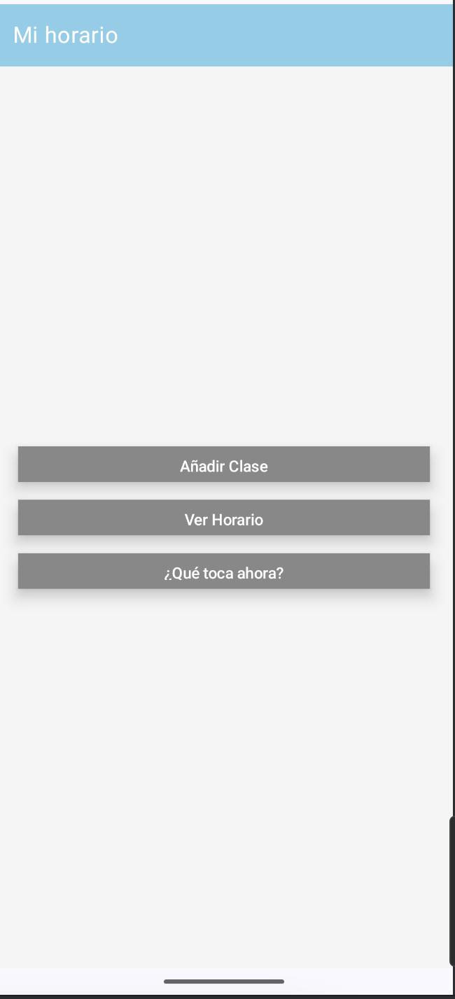
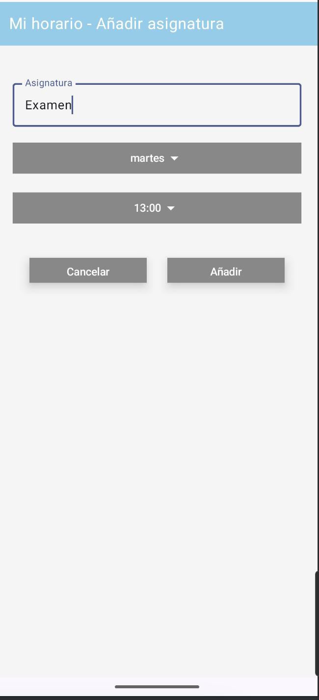
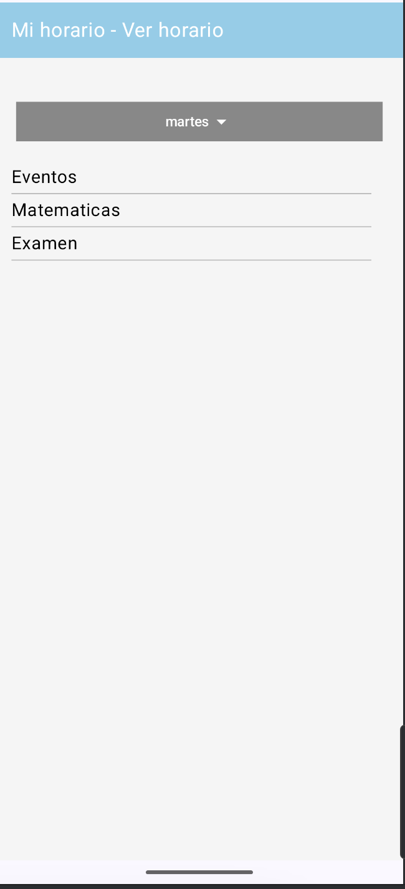
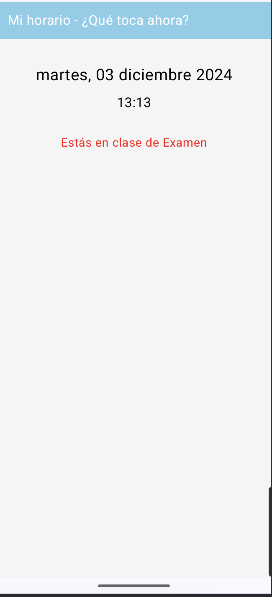
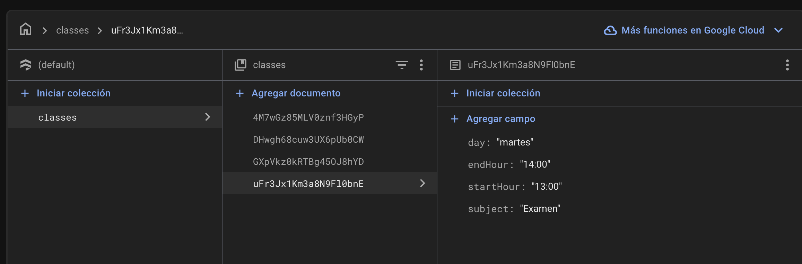

# Ejercicio 1 Examen Eventos

Este repositorio contiene una aplicación Android desarrollada en Kotlin utilizando Jetpack Compose y Firebase Firestore. La aplicación permite a los usuarios gestionar su horario de clases, añadir nuevas clases, ver el horario completo y consultar la clase actual.

## Repositorio

El código fuente de la aplicación se encuentra en el siguiente repositorio de GitHub: [Aplicacion1_prueba2](https://github.com/jmartter/Aplicacion1_prueba2.git)

## Estructura de Pantallas

### Pantalla Principal

La pantalla principal (`MainScreenUI`) es el punto de entrada de la aplicación. Desde aquí, los usuarios pueden navegar a las diferentes funcionalidades de la aplicación.

### Añadir Clase

La pantalla de añadir clase (`AddClassScreenUI`) permite a los usuarios agregar una nueva clase a su horario. Los usuarios pueden seleccionar la asignatura, el día de la semana y la hora de inicio de la clase.

### Ver Horario

La pantalla de ver horario (`ViewScheduleScreenUI`) muestra el horario completo del usuario. Los usuarios pueden seleccionar un día de la semana para ver las clases programadas para ese día.

### ¿Qué Toca Ahora?

La pantalla de ¿Qué toca ahora? (`CurrentClassScreenUI`) muestra la clase actual del usuario basada en el día y la hora actuales. Si no hay ninguna clase registrada para el momento actual, se muestra un mensaje indicando que no hay clases.

### Firebase Firestore

La aplicación utiliza Firebase Firestore para almacenar y recuperar la información de las clases. A continuación se muestra una imagen de la estructura de la base de datos en Firebase.

